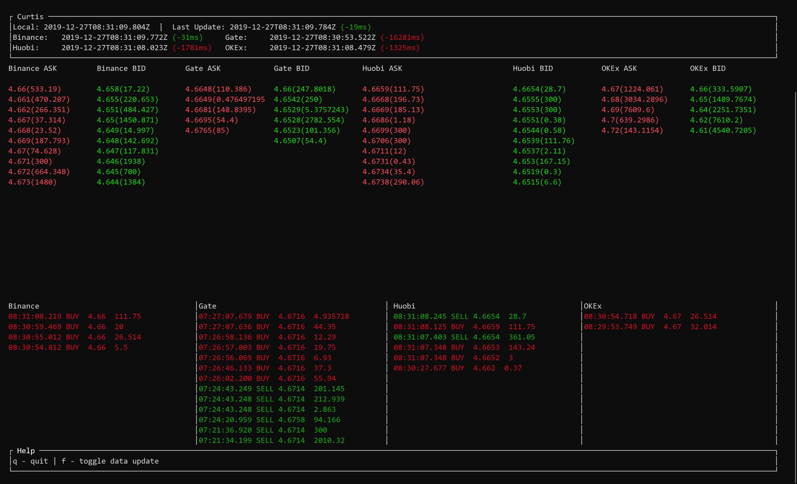

Curtis - Monitor and Trade Engine for Crypto Exchanges
====

Mostly a toy and demo to play with crypto exchanges with Rust. No serious strategy engines has been implemented yet but the TUI monitor is functional.

### Exchanges
* Binance
* Gate.io
* Huobi
* OKEx

### Strategy
* No implement yet

### Usage

Copy `curtis.toml.example` to `curtis.toml`. Fill your API key and change the websocket command to watch the target Coin. Start TUI mode with:

```
curtis -c curtis.toml --tui spot
```



`curtis -h` for more usage:

```
Curtis 0.1.0

USAGE:
    curtis [FLAGS] [OPTIONS] [SUBCOMMAND]

FLAGS:
    -h, --help       Prints help information
        --tui        Enable TUI monitor
    -V, --version    Prints version information

OPTIONS:
    -c, --config <CONFIG>    Path to configuration file

SUBCOMMANDS:
    futures    Run Futures Trade Engine
    help       Prints this message or the help of the given subcommand(s)
    spot       Run Spot Trade Engine
```